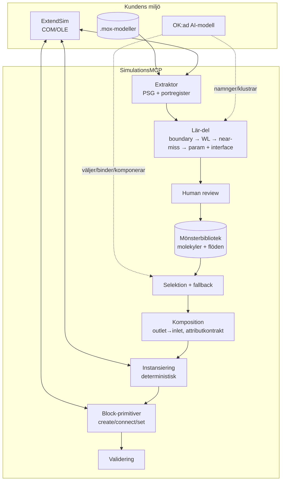

# PRD: SimulationsMCP — Mönsterbibliotek & Lär-del (Pattern Mining)

| Fält | Värde |
|------|-------|
| **Produkt** | SimulationsMCP (= ExtendSimBlocksMCP) |
| **Modul** | Pattern Library + Lär-del + Komposition |
| **Version** | v0.5 |
| **Datum** | 2026-06-26 |
| **Ägare** | Jonas — Duke Systems AB |
| **Status** | Utkast för granskning |
| **Stack** | **TypeScript MCP-server + Python COM-backend** (befintlig SimulationsMCP-stack — ingen omskrivning); ExtendSim via COM/OLE; OK:ad AI-modell (lokal eller moln) |

### Ändringar i v0.5
- **Stack rättad:** modulen byggs på den **befintliga TypeScript-MCP + Python-COM-stacken** — *ingen* C#/.NET-omskrivning. Den är ett **tillägg** till befintliga SimulationsMCP-servern och återanvänder dess verktyg (`block_add`, `block_connect`, `connection_list`, `hierarchy_list` m.fl.).
- **Molekyl = H-block (principbeslut, §1, §3, §6.3, §6.5):** verktyget är *prescriptivt* — det bygger modeller med H-block och lär därmed ut ExtendSims hierarkilogik (överskådbart, återanvändbart). Molekyler instansieras *som* H-block (FR-16).
- **Platt-modell-mining → icke-mål (§3.2, FR-6):** lär-delen gissar aldrig molekylgränser ur platta modeller. Biblioteket seedas av handskrivet baspaket (M5) + minande av redan H-block-strukturerade modeller + verktygets egna utdata.
- **V1 nedgraderad (§19):** pure/physical-detektering är till stor del redan löst i befintlig kod (`hierarchy_list`, `GetBlockTypeNumeric()==4`, `GetLibraryPathName`) → krymper från forsknings-spike till en kort bekräftelse, låg prioritet.

### Ändringar i v0.4
- Dokumenterat ExtendSims **physical vs pure hierarchy** (§4) och gjort om #2 till en *principiell klippregel* istället för heuristik (§6.3 FR-6, §9.2).
- Pure (bibliotek) → identitetsbaserad klustring, kontrakt beräknas en gång; Physical (kopia) → WL + near-miss, kontrakt per instans.
- Nytt avsnitt **§19 Verifieringsplan** — konkreta COM-spikes att köra innan M6, inkl. hur pure/physical avgörs.
- Uppdaterade öppna frågor (#2 förfinad, ny COM-detekterbarhetsfråga) och risker.

### Ändringar i v0.3
- Löst öppen fråga **#7 (attribut-detektion)**: ny väg för hur `reads`/`writes` härleds robust ur ExtendSim.
- Nytt avsnitt **§9.6 Attribut-detektion (writer/reader)** — primärväg via equation-blockens variabeltabell (COM-läsbar), sekundärväg via ModL-/include-parse, plus **must-write vs may-write** via kontrollflöde.
- Nytt krav-avsnitt **§6.7** (FR-22–FR-24) för attribut-detektion.
- Utökad **§8.3 Attributkontrakt**: kräver *must-write* för att uppfylla nedströms-krav; opaka block → `writes:["?"]` → review.
- Lagt till **konfidens-dimension** på attributkontraktet (§4) och risk för ModL-opaka/include-missar (§15).

### Ändringar i v0.2
- Lagt till **molekylens interface** (gränssnitt) i datamodellen — exponerade in-/utlopp som gör instansiering och komposition möjlig (§4, §6.5, §7.2, §9.4).
- Nytt avsnitt **§8 Komposition & flödesbyggnad** — hur molekyler kedjas till hela processflöden, routing och attributkontrakt.
- Lagt till **near-miss-pass** i klustringen (graph edit distance ovanpå WL) — löser kopplingen gränsdetektering ↔ WL (§9.2).
- Omformulerat param-inferensen — "föreslagen default + observerat intervall" istället för "fittad fördelning" (§9.3).
- Nytt avsnitt **§10 Selektion & fallback** — det tidigare osäkraste lagret.
- Lagt till **behavioral check (lager 3.5)** i testning (§12).
- Uppdaterade öppna frågor, risker och milstolpar.

---

## 1. Sammanfattning

SimulationsMCP är en MCP-server som låter en AI-agent bygga ExtendSim-modeller. För att agenten ska kunna producera korrekta modeller — t.ex. "en maskin med ett speciellt processmönster och hela process­flödet" — behöver den domänkunskap om ExtendSim-block och återkommande processmönster.

Den här modulen löser det **utan att fine-tuna någon modell**. All domänkunskap ligger som *data* (ett mönsterbibliotek) som hämtas vid behov, plus en deterministisk instansierings- och kompositionsmotor. En **lär-del** kör hos kunden och minar kundens egna `.mox`-modeller till återanvändbara molekyler — så att varje kund får ett bibliotek anpassat efter sina egna maskinkonfigurationer.

**Designprincip:** separera LLM-omdöme (val av mönster, parametervärden, kompositionsintention) från deterministisk mekanik (extraktion, kanonisering, instansiering, ihopkoppling). Mekaniken är reproducerbar och testbar; LLM:n bidrar bara med omdöme.

**Produktposition (prescriptiv):** verktyget bygger inte bara modeller — det visar ExtendSims hierarkilogik i praktiken. Varje meningsfull enhet kapslas i ett **H-block**, så att resultatet blir mer överskådbart och återanvändbart än vad de flesta modellerar för hand. De flesta kunder använder idag bara vanliga (platta) block; värdet ligger i att *föreskriva* en bättre struktur, inte härma den ostrukturerade. **Molekyl = H-block** är den bärande idén — både för det vi bygger och för den gräns vi minar längs.

---

## 2. Bakgrund & problem

- En agent som bygger ExtendSim-modeller behöver veta vilka block som finns, vilka portar de har, och hur de typiskt kopplas till meningsfulla processflöden.
- Att lägga in all denna kunskap i modellvikter (fine-tuning) är dyrt, svårt att uppdatera och svårt att verifiera.
- Centralt minande av mönster ur kundmodeller är **inte möjligt** — Duke Systems har inte tillgång till varje kunds `.mox`-filer.
- **Lösning:** en local-first lär-del som kunden kör själv på sina egna modeller och som bygger ett lokalt mönsterbibliotek.

> **Scope-antagande:** I denna lösning hanteras *ingen* datasekretess särskilt. Vi förutsätter att kunden kör en av kunden godkänd ("OK:ad") AI-modell, och att fulla parametervärden får användas i minandet. Det förenklar arkitekturen (ingen tiering, stripping eller egress-broker) och gör biblioteket rikare.

---

## 3. Mål & icke-mål

### 3.1 Mål
1. Ett **mönsterbibliotek** som data, inte vikter — uppdaterbart, granskbart, versionerbart.
2. En **deterministisk instansieringsmotor** som expanderar en molekyl till ett **H-block** med körbara block inuti — överskådbart och återanvändbart per design.
3. En **kompositionsmotor** som kedjar molekyler till hela processflöden via deras gränssnitt.
4. En **lär-del** som minar kundens `.mox`-modeller till kandidatmolekyler med realistiska default-parametrar och korrekt utläst gränssnitt.
5. En **tool-yta** (~12 tools) där agenten väljer, parametriserar och komponerar mönster och servern bygger.
6. **Testbarhet i flera lager**: schema-validering, round-trip, behavioral check, build-and-run smoke, LLM-eval.

### 3.2 Icke-mål
- Ingen fine-tuning / vikt-träning av någon LLM.
- Ingen datasekretess-/locality-plumbing (tiering, anonymisering, egress-grindar) — utanför scope per antagande ovan.
- Inte en generell graf-isomorfismslösning; "tillräckligt bra" klustring med near-miss-pass + human review räcker.
- Ingen automatisk *körning* av kundens fulla simuleringar för optimering (separat projekt).
- Ingen modellering av cross-param-beroenden eller knob-vs-brus-separation i v1 (se §17).
- **Ingen gränsdetektering i platta modeller.** Lär-delen minar bara H-block-strukturerade modeller; molekylgränser gissas aldrig ur lösa block. Värdet ligger i att *bygga* H-block-struktur, inte återskapa den ur ostrukturerade modeller (se §1).

---

## 4. Begrepp & terminologi

| Term | Betydelse |
|------|-----------|
| **PSG** | Process Structure Graph — kanonisk representation: noder (block) + edges (port-till-port). |
| **Atom** | Enskilt block + dess config. |
| **Molekyl** | Sammansatt delflöde av flera block (t.ex. "maskin med haveri"). |
| **Mönster / Flöde** | Helt processflöde, byggt av molekyler. Molekyler och flöden lagras i biblioteket. |
| **Interface (gränssnitt)** | En molekyls exponerade **inlopp** och **utlopp** — de portar som lämnas öppna mot omgivande flöde. Avgör hur molekylen kopplas in och komponeras. |
| **Inlopp / Utlopp** | Namngiven molekyl-port (inlet/outlet) som binder till en intern node-port. |
| **Attributkontrakt** | Vilka item-attribut en molekyl *läser* (kräver) respektive *skriver* (sätter), var och en med en **konfidens** (hur den härleddes). Används för att validera komposition. |
| **Must-write / may-write** | *Must-write* = attributet skrivs på *alla* vägar genom blocket; *may-write* = skrivs bara i någon gren. Endast must-write uppfyller ett nedströms-krav. |
| **H-block** | ExtendSims hierarkiska block — modellerar-ritad återanvändbar enhet. Primär molekylgräns. |
| **Physical / Pure hierarchy** | ExtendSims två H-block-lägen. *Physical* (default) = sparas som kopia i modellen, oberoende, kan driva isär. *Pure* = sparad i bibliotek, *by reference*, en delad definition som propagerar till alla instanser. |
| **WL** | Weisfeiler-Lehman — approximativ graf-kanonisering för klustring. |
| **Port-registret** | Katalog över varje blocktyps portar (namn, riktning, roll). Förutsättning för validering. |

---

## 5. Arkitektur

Modulen är ett **tillägg till den befintliga SimulationsMCP-servern** (TypeScript-MCP + Python-COM-backend) — inte en ny server och ingen omskrivning. Den återanvänder befintliga block-, koppling- och extraktionsverktyg (`block_add`, `block_connect`, `connection_list`, `hierarchy_list`, `hierarchy_get_contents` m.fl.) och lägger mönster-, kompositions- och lär-lagren ovanpå.



**Två huvudflöden:**
- **Bygg-flödet (runtime):** agent → `list_patterns`/`get_pattern` → selektion → binder params → `compose_flow` → `instantiate_pattern` → `validate_model`.
- **Lär-flödet (offline, kör hos kund):** `extract_port_registry` + `extract_psg` → `mine_patterns` → review → biblioteket.

---

## 6. Funktionella krav

### 6.1 Port-registret (förutsättning)
- **FR-1** Servern ska enumerera ExtendSims blocktyper och deras portar via COM/OLE (`extract_port_registry`).
- **FR-2** Varje portpost innehåller: blocktyp (`lib:blocktype`), portnamn, riktning (in/out), roll (item/value/connector/shutdown m.m.).
- **FR-3** Registret för standard-ExtendSim levereras färdigbyggt (samma för alla kunder); endast kundens custom-block minas lokalt.

### 6.2 Extraktion av PSG
- **FR-4** Servern ska läsa en `.mox` och returnera dess PSG (`extract_psg`): noder med `lib:blocktype` + params, edges med `srcPort→dstPort`.
- **FR-5** H-blocks och namngivna regioner bevaras som metadata för molekylgränsdetektering.

### 6.3 Lär-delen (pattern miner)
- **FR-6 Gränsdetektering (klippregel):** kandidatmolekyler härleds från H-blocks på alla nivåer (multi-scale). **Pure** (biblioteks-)H-block är *alltid* en molekylgräns — de är deklarerade återanvändbara enheter och mint:as direkt; ett yttre block som innehåller dem blir ett *flöde* som refererar dem. **Physical** (kopia-)H-block är *kandidat*-gränser, avgjorda av frekvens/stöd. **Platta modeller (utan H-block) minas inte** — molekylgränser gissas aldrig ur lösa block (§3.2). (Pure/physical-distinktion, se §4, §9.2; COM-detekterbarhet i stort sett redan löst i befintlig kod, se §19.)
- **FR-7 Kanonisering:** varje kandidatdelgraf får ett WL-fingerprint (§9.1).
- **FR-8 Klustring:** delgrafer med samma fingerprint grupperas; ett **near-miss-pass** (§9.2) slår ihop buckets som ligger nära varandra i graph edit distance.
- **FR-9 Param-inferens:** över ett klusters instanser klassificeras varje param (§9.3): *varierar* → required; *konstant* → fixed; default = median + observerat intervall.
- **FR-10 Interface-inferens:** molekylens gränssnitt härleds ur de **edges som korsar gränsklippet** — varje korsande edge blir ett namngivet inlopp/utlopp (§9.4).
- **FR-11 Namngivning:** den OK:ade modellen sätter `intent`-beskrivning, port-namn och föreslår param-schema.
- **FR-12 Human review:** ingen kandidat går in i biblioteket utan kundens godkännande (`approve_pattern`). Kandidater rankas på frekvens/stöd; auto-approve möjlig över hög tröskel.

### 6.4 Mönsterbibliotek
- **FR-13** Bibliotekspost lagras deklarativt (§7.1) med: id, intent, param-schema, **interface**, attributkontrakt, PSG-mall med placeholders, ifyllt exempel, provenance.
- **FR-14** Flöden (kompositioner) lagras i samma bibliotek (§7.3), refererande molekyl-id:n + wiring.
- **FR-15** Biblioteket är versionerat och sökbart på intent (`list_patterns`, `get_pattern`).

### 6.5 Instansiering & komposition
- **FR-16** `instantiate_pattern` ska **deterministiskt** expandera en molekyl + param-bindningar till block-/connect-anrop **och kapsla dem i ett H-block** vars exponerade connectorer = molekylens interface (§7.1) — ingen LLM i detta steg. Inkapslingen i H-block är det som gör utdatat överskådbart och återanvändbart (molekyl = H-block, §1).
- **FR-17** `compose_flow` ska deterministiskt koppla flera molekylinstanser via deras interface: ett utlopp binds till ett inlopp endast om rollerna matchar (§8.2).
- **FR-18** Komposition ska validera **attributkontrakt**: en molekyl som *kräver* attribut X får bara placeras nedströms en molekyl som *sätter* X (§8.3).
- **FR-19** Saknad required-param, okänd port, rollkrock eller obrutet attributkontrakt ger fail-closed-fel, aldrig en gissning.

### 6.6 Selektion & agentflöde
- **FR-20** Servern ska erbjuda intent-baserad selektion med confidence (§10) och en fallback-stege när inget mönster når tröskeln.
- **FR-21** Agenten ska kunna: söka → välja → binda → komponera → instansiera → validera, via tool-ytan.

### 6.7 Attribut-detektion
- **FR-22 Primärväg:** för equation-block (Equation(I), Queue Equation, Query Equation(I)) ska detektorn läsa blockets in/ut-variabeltabell via COM — ut-variabel bunden till attribut = skrivning, in-variabel = läsning. Strukturerade skrivare (Set, Create) läses ur dialogen (§9.6).
- **FR-23 Sekundärväg:** för attribut som refereras direkt i ModL utan deklarerad variabel ska equation-texten **plus refererade include-filer** parsas; LHS = skrivning, RHS = läsning. Når parsern inte konfidens → blocket markeras opakt (`writes:["?"]`).
- **FR-24 Must/may-write:** kontrollflödesanalys avgör om en skrivning sker på alla vägar. Komposition (FR-18) får endast godkänna *must-write* som uppfyllande av ett nedströms-krav.

---

## 7. Datamodeller

### 7.1 Molekylpost (bibliotek)
```json
{
  "id": "machine-with-breakdowns",
  "version": "1.0",
  "kind": "molecule",
  "intent": "Maskin som processar items med stokastiska haverier",
  "params": {
    "process_time": { "type": "distribution", "required": true },
    "mtbf":         { "type": "distribution", "required": true },
    "mttr":         { "type": "distribution", "required": true },
    "capacity":     { "type": "int", "required": false, "default": 1 }
  },
  "psg": {
    "nodes": [
      { "ref": "q",   "lib": "Item", "type": "Queue" },
      { "ref": "act", "lib": "Item", "type": "Activity",
        "params": { "D": "{{process_time}}", "capacity": "{{capacity}}" } },
      { "ref": "sd",  "lib": "Item", "type": "Shutdown",
        "params": { "up": "{{mtbf}}", "down": "{{mttr}}" } }
    ],
    "edges": [
      { "from": "q.out",       "to": "act.in" },
      { "from": "sd.shutdown", "to": "act.shutdown" }
    ]
  },
  "interface": {
    "inlets":  [ { "port": "in",  "binds": "q.in",   "role": "item" } ],
    "outlets": [ { "port": "out", "binds": "act.out", "role": "item" } ]
  },
  "attributes": { "reads": [], "writes": [] },
  "example": { "process_time": "Triangular(2,3,5)", "mtbf": "Exp(120)", "mttr": "Exp(8)" },
  "provenance": { "mined_from": 14, "source": "customer-local",
                  "wl_fingerprint": "…", "support": 14 }
}
```

### 7.2 Port-registerpost
```json
{ "lib": "Item", "type": "Activity",
  "ports": [
    { "name": "in",       "dir": "in",  "role": "item" },
    { "name": "out",      "dir": "out", "role": "item" },
    { "name": "shutdown", "dir": "in",  "role": "connector" }
  ] }
```

### 7.3 Flödespost (komposition)
```json
{
  "id": "line-mill-then-inspect",
  "kind": "flow",
  "intent": "Bearbetning följt av inspektion med omkörning av kassationer",
  "instances": [
    { "ref": "m1", "pattern": "machine-with-breakdowns", "params": { "...": "..." } },
    { "ref": "insp", "pattern": "inspection-rework",      "params": { "...": "..." } }
  ],
  "wiring": [
    { "from": "m1.out", "to": "insp.in" }
  ]
}
```

### 7.4 PSG (extraherad)
Samma struktur som `psg` ovan, men noder bär faktiska parametervärden istället för placeholders. Korsande (dinglande) edges markeras som boundary för interface-inferens.

---

## 8. Komposition & flödesbyggnad

Det är här "hela processflödet" levereras. Ett **flöde** är en graf vars noder är molekyl­instanser och vars edges kopplar ett utlopp till ett inlopp.

### 8.1 Kompositionsmodell
- En molekyl exponerar sitt **interface** (§7.1): namngivna inlopp/utlopp som binder till interna node-ports.
- Ett flöde (§7.3) listar molekylinstanser + `wiring` (utlopp→inlopp).
- `compose_flow` plattar deterministiskt ut flödet: instansierar varje molekyl, kopplar sedan ihop dem enligt wiring genom att binda de underliggande node-portarna.

### 8.2 Rollkompatibilitet
Ett utlopp får bindas till ett inlopp **endast** om rollerna matchar (`item`→`item`, `value`→`value`, …). Rollkrock är fail-closed-fel (FR-19). Det förhindrar att agenten kopplar t.ex. en value-utgång till ett item-inlopp.

### 8.3 Attributkontrakt
Varje molekyl deklarerar vilka item-attribut den **läser** (kräver) och **skriver** (sätter), var och en med konfidens. Hur `reads`/`writes` härleds beskrivs i §9.6. Vid komposition gäller:
> En molekyl som kräver attribut X får bara placeras nedströms en molekyl (eller källa) som **must-skriver** X.

En *may-write* (skrivning bara i en gren) räcker **inte** för att uppfylla kravet. Ett **opakt** block (`writes:["?"]`) behandlas som "kan inte garanteras" → flaggas för review, släpps aldrig tyst. Brutet kontrakt → fail-closed. Detta fångar den vanligaste tysta felklassen: en nedströms-molekyl som routar/filtrerar på ett attribut som aldrig sattes uppströms.

### 8.4 Routing-molekyler
Molekyler kan ha **flera utlopp** (t.ex. en Select Item Out som grenar på attribut). Interface-modellen hanterar detta naturligt — varje gren är ett namngivet utlopp. Flödets wiring kopplar varje gren till rätt nedströms-inlopp.

### 8.5 Hela flöden som högre ordningens mönster
Lär-delen kan mina inte bara molekyler utan **hela flöden** — återkommande *sekvenser* av molekyler över kundens modeller. Dessa lagras som flödesposter (§7.3) och ger agenten färdiga större byggstenar, inte bara enskilda maskiner. (Ersätter den tidigare öppna frågan om mönster-som-refererar-mönster.)

---

## 9. Algoritmer

### 9.1 WL-kanonisering (fingerprint)
Nodlabel = topologi (`lib:blocktype`), **inte** params. Edge-label bär portnamn + riktning, vilket gör "shutdown→Activity" strukturellt skilt från "out→in".

```
label[n] = f"{n.lib}:{n.blocktype}"          # init

for r in range(K):            # K ≈ 3–4 räcker för molekyler om 3–10 block
    new = {}
    for n in nodes:
        sig = []
        for e in out_edges(n):
            sig.append(("out", e.srcPort, e.dstPort, label[e.dst]))
        for e in in_edges(n):
            sig.append(("in",  e.dstPort, e.srcPort, label[e.src]))
        new[n] = hash((label[n], tuple(sorted(sig))))
    label = new

fingerprint = hash(tuple(sorted(label.values())))
```

### 9.2 Near-miss-pass (löser gräns ↔ WL-kopplingen)
WL fingerprintar en *hel* delgraf, så två instanser klippta med lite olika gränser hamnar i olika buckets. Efter WL-bucketing:
1. Välj en representant per bucket.
2. Beräkna graph edit distance (GED) mellan representanter.
3. Slå ihop buckets under en liten GED-tröskel — flagga sammanslagningen för review.

Klustra på **interiör kärna + explicit interface**; behandla boundary-block som valfria så att en extra/saknad randnod inte spräcker klustret.

**Pure vs physical styr om WL ens behövs:**
- **Pure (bibliotek):** alla instanser delar definition by reference → garanterat identiska. Klustra på **blocktyps-identitet**, inte WL. Hög konfidens. Attributkontraktet beräknas *en gång* på definitionen och delas.
- **Physical (kopia):** kan ha drivit isär (copy-paste-drift) → detta är det egentliga skälet till WL + near-miss. Attributkontrakt beräknas *per instans*, klustras därefter.

Om COM inte kan skilja pure från physical (se §19) faller allt tillbaka på WL; pure-fallet "råkar då bara alltid klustra perfekt", till en högre kostnad.

### 9.3 Param-inferens
För varje param `p` över klustrets `N` instanser:
- värdet **varierar** → `required: true` (modelleraren tunar det).
- värdet är **konstant** för alla → `fixed`, bakas in i PSG-mallen.
- `default` = **median av observerade värden**, plus **observerat intervall [min, max]**.

> Notera: med få instanser (N litet) *fittas ingen fördelning* — du har valda parametervärden, inte sampelobservationer. Default + intervall är ett *förslag*, inte en statistisk skattning. Knob-vs-brus och cross-param-beroenden är utanför v1.

### 9.4 Interface-inferens
Vid minande: gränsklippet (H-block-/regiongränsen) skär av ett antal edges. Varje **korsande edge** blir en molekyl-port:
- edge som går *in* över gränsen → **inlopp** (binder till mål-node.port).
- edge som går *ut* över gränsen → **utlopp** (binder till käll-node.port).
Roller ärvs från port-registret. LLM:n namnger portarna meningsfullt; bindningen är deterministisk.

### 9.5 Round-trip-invariant
```
extract_psg( instantiate_pattern(m, m.example) )  ≡  källdelgrafen(m)
```
Jämförelsen sker på WL-fingerprint + parametervärden + interface (exakt).

### 9.6 Attribut-detektion (writer/reader)
Attribut skrivs genom två ytor som kräver två detektorer. Tiered, fail-closed:

**1. Writer-katalog (förutsättning).** Härled ur registret vilka blocktyper som *kan* röra attribut och *hur* (dialog-fält, kod, eller inte alls). Detektorn djupinspekterar bara dessa block — riktad, inte gissande. Utökas för custom-block.

**2. Strukturerade skrivare → dialog (hög konfidens).** Set och Create läses deterministiskt ur dialogen via COM. `writes:[X]`, `conf: high`.

**3. Equation-block → variabeltabell (primärväg).** Det rekommenderade idiomet binder ett attribut till en namngiven in/ut-variabel. Läs tabellen via COM: ut→skrivning, in→läsning. Deterministiskt, gäller även custom-block (dialoger COM-åtkomliga). Täcker normalfallet billigt.

**4. Equation-block → kod + includes (sekundärväg).** För det "andra sättet" (attribut direkt i ModL utan deklarerad variabel) parsas equation-texten **plus refererade include-filer** (en skrivning kan ligga i en include-definierad funktion — utan include-följning missas den). LHS = skrivning, RHS = läsning.

**5. Idiom-avvikelse = triage-signal.** Ett block som rör attribut *utan* deklarerad variabel avviker från idiomet → exakt det block som ska få djup-parse eller review. Gratis prioritering av var den dyra analysen behövs.

**6. Must vs may-write (alltid kodnivå).** Variabeltabellen säger *om* en skrivning kan ske, inte att den *alltid* sker. En ut-variabel tilldelad bara i en `if`-gren är may-write. Kontrollflödesanalys avgör must vs may; endast must-write uppfyller ett nedströms-krav (§8.3).

**7. Fail-closed + runtime cross-check.** Otillräcklig konfidens (indirekt åtkomst, pekare/array, djup include-kedja) → opakt, `writes:["?"]`. Starkaste validatorn av ModL-grenen: en kort instrumenterad körning som observerar vilka attribut som faktiskt *ändrar värde* över blocket — bekräftar statisk detektion och validerar writer-katalogen.

---

## 10. Selektion & fallback

Det tidigare osäkraste lagret. Agenten ska *välja* rätt mönster ur intent.

- **Retrieval:** embedding på intent-beskrivningen + en topologi-signatur (t.ex. WL-fingerprint-prefix), så både semantik och struktur väger in.
- **Confidence-tröskel:** varje träff får en score; under tröskeln räknas det som "ingen träff".
- **Fallback-stege** när inget mönster når tröskeln:
  1. Exakt eller near-miss-mönster (över tröskel).
  2. Komponera ur mindre molekyler (§8) som *tillsammans* täcker intent.
  3. Bygg ur atomer (block-primitiver) — fritt bygge, ingen mönsterhjälp.
  4. Eskalera till människa.

Selektion (1–2) görs av LLM:n men **valideras alltid** av den deterministiska kompositionen (rollkompatibilitet + attributkontrakt) innan instansiering.

---

## 11. MCP tool-yta

| # | Tool | In | Ut | Determinism |
|---|------|----|----|-------------|
| 1 | `extract_port_registry` | — | portregister | Deterministisk |
| 2 | `extract_psg` | mox-path | PSG | Deterministisk |
| 3 | `mine_patterns` | psg-set | kandidatmolekyler/-flöden | Det. kärna + LLM-namngivning |
| 4 | `approve_pattern` | kandidat-id, beslut | bibliotekspost | Människa |
| 5 | `list_patterns` | intent-query | mönsterlista + scores | Deterministisk |
| 6 | `get_pattern` | pattern-id | mönster-/flödespost | Deterministisk |
| 7 | `compose_flow` | molekylinstanser + wiring | flödesplan | Deterministisk |
| 8 | `instantiate_pattern` | pattern-id, params | block-/connect-plan | Deterministisk |
| 9 | `create_block` | lib, type | block-id | Deterministisk |
| 10 | `connect_blocks` | from-port, to-port | ok | Deterministisk |
| 11 | `set_param` | block-id, param, värde | ok | Deterministisk |
| 12 | `validate_model` | model | valideringsrapport | Deterministisk |

LLM:n anropar endast 3 (namngivning), 5, 6 och uttrycker komposition/params till 7–8. All mekanisk expansion och ihopkoppling (7–12) är LLM-fri.

**Tillägg, inte ersättning:** verktyg 9–12 (`create_block`, `connect_blocks`, `set_param`, `validate_model`) motsvarar de **befintliga** serververktygen (`block_add`, `block_connect`, `block_set_value`, `model_validate`) och byggs *inte* om — de listas för fullständighet. Endast 1–8 är nya. Likaså återanvänder extraktionen (1–2) befintliga `hierarchy_list`/`hierarchy_get_contents`/`connection_list`.

---

## 12. Testning & validering

Fem lager, billigast → skarpast:

1. **Schema-/kontraktvalidering** (deterministisk): mönster valideras mot JSON-schema — portar finns i registret, edges pekar på existerande noder, interface binder till verkliga node-ports, required-params har schema.
2. **Round-trip / golden file** (§9.5): `instantiate → extract → jämför`. Snapshot per mönster.
3. **Behavioral check (lager 3.5)**: kör källmolekyl och instansierad molekyl med *samma seed/input*, jämför nyckelstatistik (throughput, kötid) inom tolerans. Fångar logiska fel som strukturen inte avslöjar.
4. **Build-and-run smoke test**: instansiera in i ExtendSim via COM, kör kort, assert utan fel. ExtendSim är validatorn för okopplade portar / ogiltiga params.
5. **LLM-eval (separat)**: `intent → förväntat mönster/komposition`-par. Mäter selektion + param-rimlighet, hålls skilt från mekaniktesten så man vet *vilket lager* som fallerade.

---

## 13. Icke-funktionella krav

- **NFR-1 Determinism:** lager 7–12 ger identisk output för identisk input.
- **NFR-2 Reproducerbarhet:** WL-fingerprint stabilt mellan körningar (sorterade multimängder).
- **NFR-3 Lokal exekvering:** hela lär-flödet körbart on-prem hos kund.
- **NFR-4 Prestanda:** minande av ≤ några hundra modeller på minuter; WL nära linjär, GED-pass endast inom WL-buckets.
- **NFR-5 Versionering:** mönster, flöden och portregister versioneras; biblioteket diff-bart.
- **NFR-6 Inkrementellt:** ny mining slår ihop nya instanser i befintliga kluster (stabila fingerprints), skapar inte dubbletter.

---

## 14. Antaganden & beroenden

- Kunden kör en av kunden **godkänd AI-modell** (lokal eller moln); ingen sekretess-plumbing krävs.
- ExtendSim med COM/OLE-API tillgängligt på kundens maskin.
- Node.js-runtime (TypeScript MCP-server) + Python med pywin32 (COM-backend) — befintlig stack, ingen ny runtime.
- Standard-ExtendSim-portregistret levereras med produkten.
- Duke har en **intern referenskorpus** (sample/syntetiska modeller) för CI, eftersom riktiga kundmodeller är kundsidiga (se §17).

---

## 15. Risker

| Risk | Konsekvens | Mitigering |
|------|------------|-----------|
| Inkonsekvent gränsdetektering | Identiska molekyler klustrar inte | Interiör kärna + interface; near-miss-pass (§9.2) |
| WL/GED falska sammanslagningar | Olika molekyler slås ihop | Human review (FR-12); GED-tröskel konservativ |
| Tunna kluster | Osäker param-/interface-inferens | Min-stöd-tröskel; markera lågfrekventa mönster |
| Svag selektion | Agent väljer fel mönster | Confidence-tröskel + fallback-stege (§10); deterministisk kompositionsvalidering fångar inkompatibilitet |
| Brutet attributkontrakt upptäcks sent | Modell kör men beteendet fel | Attributkontrakt valideras vid komposition (§8.3) + behavioral check (lager 3.5) |
| ModL-skrivning missas (include-funktion, indirekt åtkomst) | Falskt "skriver inte X" → felaktig komposition | Include-följning; idiom-avvikelse-triage; opakt→review; runtime cross-check (§9.6) |
| Pure/physical ej COM-skiljbara | Klippregeln (FR-6) blir icke-deterministisk | I stort sett redan löst via `GetLibraryPathName`/`hierarchy_list` i befintlig kod (§19); fallback: WL för allt. Låg risk — H-block är minoriteten |
| Ingen intern testkorpus hos Duke | Kan ej testa egen produkt i CI | Bygg sample-/syntetisk referenskorpus (M2) |
| COM/OLE-egenheter per ExtendSim-version | Extraktion bryts | Versionsmatris + smoke-test mot referensmodeller |
| Review-flaskhals vid många kandidater | Lär-delen fastnar i granskning | Batch-review rankad på stöd; auto-approve över hög tröskel |

---

## 16. Milstolpar

| Fas | Innehåll |
|-----|----------|
| **M1** | Port-register-extraktor + standardregister byggt och verifierat |
| **M2** | PSG-extraktor + **intern referenskorpus** + golden-file-tester |
| **M3** | Deterministisk `instantiate_pattern` + block-primitiver + `validate_model` |
| **M4** | Molekyl-**interface** + `compose_flow` (rollkompatibilitet + attributkontrakt) |
| **M5** | Handskrivet baspaket av molekyler + flöden (verifierar round-trip + behavioral end-to-end) |
| **M6** | Lär-delen: gränsdetektering + WL + near-miss + param-/interface-inferens + **attribut-detektion** (writer-katalog, variabeltabell, ModL/include-parse, must/may-write) |
| **M7** | Selektion + fallback + LLM-eval-set |
| **M8** | Mining av **hela flöden** (högre ordningens mönster) + inkrementell om-mining |
| **M9** | Agentintegration: full bygg-loop select→compose→instantiate→validate |

---

## 17. Öppna frågor

1. Min-stöd-tröskel för att en kandidat ska föreslås (antal instanser)?
2. Nästlade H-blocks: **principiell regel satt** (pure → alltid molekyl + referens; physical → frekvensstyrd, §6.3). Kvar: hur djupt physical-nästling ska plattas innan en nivå blir egen kandidat?
3. **Pure/physical via COM:** exponerar ett H-block sin bibliotekstyp/-definition så att pure och physical kan skiljas vid extraktion? Avgör om FR-6 blir deterministisk. Verifieras enligt §19.
4. GED-tröskel för near-miss-sammanslagning — hur sätts den utan att slå ihop för aggressivt?
5. Format för param-fördelningar — egen DSL eller direkt ExtendSim-syntax i `default`?
6. Konfliktlösning när kundens minade mönster krockar med basbibliotekets (samma id, olika topologi)?
7. Hur byggs Dukes interna referenskorpus — handgjorda sample-modeller, syntetiskt genererade, eller en blandning?
8. ~~Attribut-detektion~~ **(löst i §9.6)** → följdfråga: hur djup ska kontrollflödesanalysen (must/may-write) vara innan vi faller tillbaka på runtime cross-check istället?

---

## 18. Appendix — exempel på minat resultat

**Källa:** 14 H-blocks med namn "Bearbetning*" över kundens modeller, alla med topologin Queue→Activity + Shutdown.
**WL-fingerprint:** identiskt → ett kluster (inget near-miss-pass behövdes).
**Interface-inferens:** gränsklippet skar två edges → inlopp `in` (binds `q.in`), utlopp `out` (binds `act.out`), båda roll `item`.
**Param-inferens:** `process_time`, `mtbf`, `mttr` varierar (required); `capacity` konstant = 1 (fixed); defaults = median + intervall.
**Komposition:** molekylen kopplas nedströms en "Källa"-molekyl som sätter attributet `partType`; en nedströms "Inspektion"-molekyl kräver `partType` → attributkontraktet håller.
**Resultat:** molekylposten i §7.1 + flödesposten i §7.3, redo för review.

---

## 19. Verifieringsplan (COM-spikes före M6)

Flera designval vilar på antaganden om vad ExtendSims COM/OLE-API exponerar. De är inte verifierade ännu. Nedan står *exakt hur* var och en bekräftas. Kör dessa som små spikes innan lär-delen (M6) byggs — de avgör om regler blir deterministiska eller måste falla tillbaka på heuristik.

### V1 — Pure vs physical hierarchy (avgör FR-6, §9.2) — *till stor del redan löst*
**Status:** den befintliga Python-backenden har redan det mesta V1 förutsatte:
- `hierarchy_list` enumererar alla H-block med förälder, djup och intern blockräkning (`ObjectIDNext(0,1)`, `GetEnclosingHblockNum2`, `LocalNumBlocks2`).
- H-block-detektering via `GetBlockTypeNumeric() == 4`; innehåll via `hierarchy_get_contents` (`LocalToGlobal2`).
- Bibliotekstillhörighet via `GetLibraryPathName(blockId, 2)` — sannolikt exakt pure/physical-signalen.

**Kvarvarande bekräftelse (~10 min, inget nytt byggs):** kör `hierarchy_list` + `GetLibraryPathName` på en testmodell med ett pure-H-block (sparat i bibliotek, två instanser) och ett physical-H-block (kopierat en gång). Bekräfta att `GetLibraryPathName` returnerar ett biblioteksnamn för pure men tomt/modell för physical. Fallback om signalen saknas: inspektera `.mox`-serialiseringen (pure = biblioteksreferens, physical = substruktur inline).

**Utfall:** finns signalen → FR-6 deterministisk direkt. Annars → WL för allt (pure klustrar ändå perfekt). **Låg prioritet** eftersom H-block är minoriteten och platta modeller inte minas (§3.2).

### V2 — Equation-blockens variabeltabell (avgör §9.6 primärväg)
**Antagande:** in/ut-variabeltabellen i Equation(I)/Queue Equation/Query Equation(I) är COM-läsbar, med attributbindning + riktning.

**Så bekräftar du:** lägg ett Equation(I)-block som binder ett attribut till en ut-variabel (rekommenderat idiom) och ett till en in-variabel. Via COM, läs blockets variabeltabell och bekräfta att du kan utläsa (a) variabelnamn, (b) bundet attribut, (c) riktning in/ut. Gör om för ett custom-block för att bekräfta att custom-dialoger beter sig lika.

**Utfall:** lyckas → billig deterministisk attribut-detektion för normalfallet. Misslyckas → tyngre kod-parse blir primärväg.

### V3 — Equation include-filer (avgör §9.6 sekundärväg)
**Antagande:** include-filer som ett equation-block använder går att nå och läsa för parse, så skrivningar i include-definierade funktioner inte missas.

**Så bekräftar du:** ge ett equation-block en include-fil (via dialogens "Use include files") som definierar en funktion vilken sätter ett attribut. Via COM, bekräfta att du kan (a) lista vilka include-filer blocket använder och (b) nå deras sökväg/innehåll. Verifiera att din parse hittar skrivningen *inne i* include-funktionen.

**Utfall:** lyckas → include-följning implementerbar. Misslyckas → markera alla include-använda equation-block som opaka (`writes:["?"]`) och förlita dig på runtime cross-check (§9.6 steg 7).

### V4 — Attribut-ändring vid runtime (stärker §9.6 cross-check)
**Antagande:** en kort instrumenterad körning kan observera vilka attribut som faktiskt *ändrar värde* över ett block.

**Så bekräftar du:** kör testmodellen, läs item-attribut före/efter ett känt Set-block via COM eller trace, bekräfta att ändringen syns. Det validerar både writer-katalogen och den statiska detektionen.

**Beroende:** V1–V3 bör vara klara innan M6 startar; V4 kan löpa parallellt med M6 som stärkande validering.
