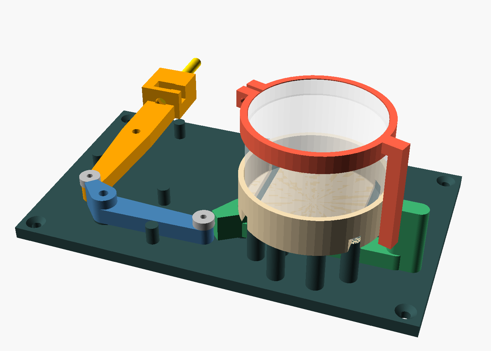
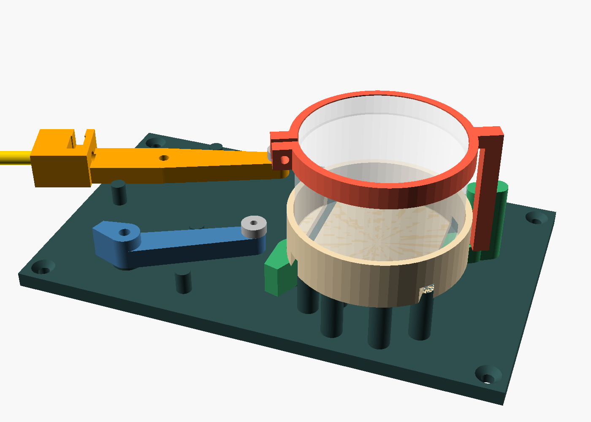
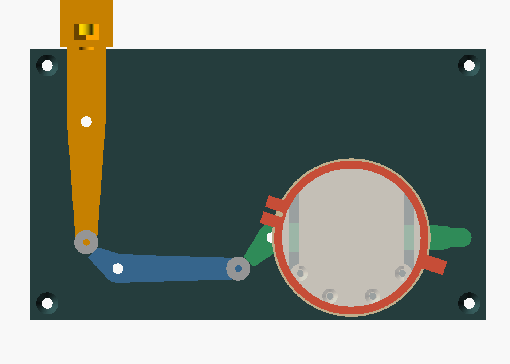
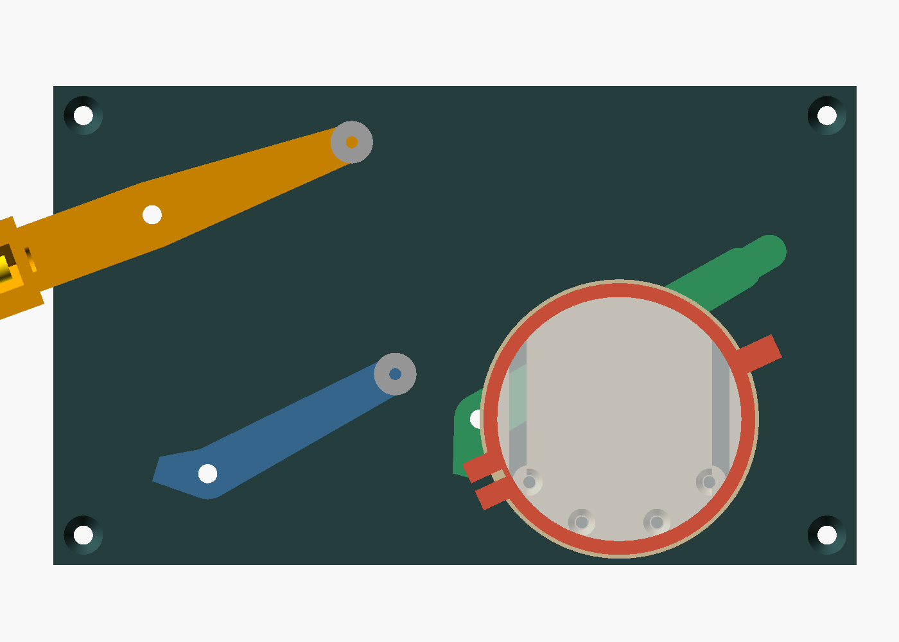

# Grindsläppare – tidsstyrd släppare för bandgrind

En parametrisk OpenSCAD-modell (`grindslappare.scad`) av en mekanism som håller
handtaget på en bandgrind med fjäderrulle, t.ex. Flexigera. Mekanismen släpper
handtaget när en vanlig mekanisk äggklocka når noll, och rullen drar sedan in
bandet. Handtaget hänger på en rostfri bult som också leder stängselströmmen.

| Låst | Utlöst |
|---|---|
|  |  |
|  |  |

## Så fungerar den

Bandet drar med 20–50 N, men en äggklocka orkar bara ett par Nmm. Därför minskas
kraften i tre steg:

1. **Krokarm (orange).** Handtaget hakas på en M6-bult i armens topp. Bandet vill
   vrida armen moturs. Armens svans har ett kullager som trycker mot…
2. **Spärr (blå).** Kraften från lagret går nästan rakt mot spärrens axel. Spärren
   vill släppa med ett litet moment, eftersom `e2` är större än 0. Spärrens spets
   har också ett kullager som hålls av…
3. **Blockerare (grön).** Kraften från spärren går nästan genom blockerarens axel
   med en liten offset åt det hållande hållet, eftersom `e3` är mindre än 0.
   Blockeraren hålls dessutom nere av sin egen vikt mot en stoppklack.
4. **Äggklockan** står i en kopp. Fingerringen (röd) kläms fast på klockans
   vridbara del, och när klockan går mot noll lyfter fingret blockerarens flagga.
   Då släpper hela kedjan.

Med standardvärdena och 40 N i bandet skriver OpenSCAD ut ungefär följande i
konsolen: 71 N i spärrkontakten, 3 N i blockerarkontakten och bara runt 1–5 Nmm
som klockan behöver orka, blockerarens vikt inräknad. Eftersom kontakterna är
kullager spelar friktionen nästan ingen roll.

## Anpassa modellen

Öppna `grindslappare.scad` i OpenSCAD och använd **Customizer**-panelen.
Det viktigaste att mäta och ställa in:

| Parameter | Vad |
|---|---|
| `klocka_d`, `klocka_topp_d`, `klocka_h` | Din äggklockas kroppsdiameter, diametern på den vridbara delen och höjden |
| `klocka_moturs` | Om klockan går moturs mot noll, sett framifrån. De flesta gör det |
| `spegla` | Sätt till `true` om bandet kommer från höger sida sett framifrån |
| `finger_d`, `skalle_nv`, `skalle_h` | Fingerbulten. Standard är M6 med sexkantsskalle |
| `krok_L`, `krok_r` | Krokarmens längder. Längre `krok_r` ger mindre kraft på spärren |
| `e2`, `e3` | Hur gärna spärren vill släppa och hur hårt blockeraren håller (se Kalibrering) |
| `band_kraft` | Används bara för kraftberäkningen i konsolen |

Välj `del` för att visa eller exportera en enskild del. `montage` visar hela
enheten och `utlost = true` visar den i utlöst läge. Kör `./exportera_stl.sh`
för att exportera alla STL-filer och bilder. Färdiga STL-filer med
standardvärdena ligger i `stl/`.

## Utskrift (Bambu Lab)

- **Material:** PETG eller ASA/ABS eftersom den sitter ute. PLA mjuknar i sol och
  kryper under last.
- **Inställningar:** 0,2 mm lagerhöjd, 4 väggar, 5 topp- och bottenlager och 40 %
  gyroid-infill. Inga stöd behövs.
- **Orientering:** STL-filerna ligger redan rätt. Armarna ligger platt och
  fingerringen ligger med ringen mot plattan och benet uppåt.
- **Storlek:** bottenplattan är cirka 189 × 113 mm och får plats på A1, P1 och X1
  (256 mm). På en **A1 mini** (180 mm) får du minska `klocka_d` eller `krok_r`,
  eller dela plattan.
- Krokarmen tar all last. Skriv gärna ut den med 6 väggar och 60 % infill.

## Stycklista

Använd rostfritt (A2 eller A4) till allt eftersom enheten sitter ute.

| Antal | Detalj | Till |
|---|---|---|
| 1 | M6×40 sexkantsskruv, rostfri, + M6-mutter + bricka | Fingret som handtaget hakas på och som leder strömmen |
| 1 | Ringkabelsko M6, förtennad | Stängselkabeln till fingret |
| – | Stängselkabel (högspänningskabel) + kabelklämma till tråden/bandet | Strömmen från stängslet |
| 1 | M4×16 insexskruv + bricka | Krokarmens axel |
| 2 | M4×20 insexskruv + bricka | Spärrens och blockerarens axlar |
| 3 | M4-mutter | Trycks in i plattans baksida |
| 2 | Kullager 623-2RS (3×10×4, gummitätat) eller 623ZZ | Rullarna i steg 1 och 2 |
| 2 | M3×12 skruv + bricka | Lageraxlar, gängas direkt i plasten |
| 4 | M3×10 försänkt | Klockkoppen mot pelarna |
| 1 | M3×16 + M3-mutter | Klämskruv på fingerringen |
| 4 | Träskruv 4–4,5 mm, försänkt, ca 40 mm | Plattan mot en trästolpe. Använd slangklämmor eller M4 genom stolpen om den är av metall |
| 1 | Mekanisk äggklocka, 60 min, där hela toppen vrids | Timern |
| 1–2 buntband | | Håller klockan i koppen |
| ca 150 g | PETG- eller ASA-filament | Alla tryckta delar |

## Montering

1. Tryck in M4-muttrarna (eventuellt med en droppe lim) i sexkantsfickorna på plattans baksida.
2. Skruva fast krokarm, spärr och blockerare på sina navbrickor med M4 och en
   bricka ovanpå. Dra inte åt hårdare än att armarna svänger fritt.
3. Skruva fast lagren på krokarmens svans och spärrens spets med M3 och en bricka
   under skallen. Den lilla upphöjda ringen gör att lagret går fritt från armen.
4. Lägg in bultskallen i sexkantsfickan med kabelskon mellan skallen och väggen
   ovanför. Stick bulten upp genom blocket och dra åt med mutter och bricka ovanpå
   blocket.
5. Skruva fast klockkoppen på pelarna. Ställ klockan i koppen, gärna med ett
   buntband genom spåren i botten.
6. Trä fingerringen på klockans vridbara del, men dra inte åt den än.

## Kalibrering

1. Ställ klockan på **0**. Vrid fingerringen tills fingret precis har lyft
   flaggan så att blockeraren står mot sitt övre stopp. Backa sedan ett par
   minuter på ringen och dra åt klämskruven. Då släpper mekanismen ungefär vid 0.
2. **Om spärren inte släpper** när blockeraren lyfts: öka `e2`, till exempel till
   2–2,5.
3. **Om det släpper av sig självt**, till exempel när det blåser: gör `e3` mer
   negativ, till exempel -1,2, eller öka `band_kraft`-marginalen genom att öka
   `krok_r`.

## Så laddar du

1. Låt klockan stå på **0**. Då håller fingret blockeraren uppe.
2. Fäll upp krokarmen till lodrätt läge. Spärren faller på plats bakom lagret av
   egen vikt.
3. **Vrid upp klockan** till önskad tid. Fingret lämnar flaggan och blockeraren
   faller ned och låser spärren.
4. Haka på grindhandtaget på bulten.

## Stängselström och säkerhet

- Kabeln ansluts till bulten, som är den enda strömförande delen. Lägg en slinga
  på kabeln så att krokarmen kan slå upp utan att dra i den.
- Det är cirka 30 mm plastyta mellan bulten och den närmaste andra metalldelen,
  alltså krokarmens axel. Skruva inte i metall närmare bulten än så, och placera
  gärna enheten under ett litet tak.
- **Rör bara plastdelarna när du laddar**, eller slå av aggregatet.
- Handtaget åker snabbt in till rullen när mekanismen släpper. Se till att inga
  djur eller människor står i vägen.
